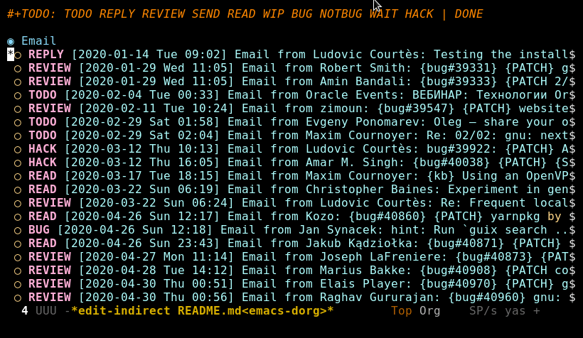

# Dorg

Dorg is an [Emacs](https://www.gnu.org/software/emacs/) package that allows
update [Org-mode](https://orgmode.org/) buffer according to latest status of
bug on [Debbug bugs tracker](https://debbugs.gnu.org/).



## Prerequisites

The only dependencies are Org-mode and Debbugs itself, which you probably
already installed.

## Installing Dorg

To install Dorg, follow these steps.

Clone the repository:

``` bash
git clone https://github.com/kitnil/dorg
```

Add to your Emacs's configuration file:

``` emacs-lisp
(load "PATH-TO-CLONNED-GIT-REPOSITORY/dorg.el" t)
```

## Using Dorg

To use Dorg, you should open an Org-mode file which is populated with Debbugs
bugs, for example my `~/src/org/inbox.org`:

``` org
#+TODO: TODO REPLY REVIEW SEND READ WIP BUG NOTBUG WAIT HACK | DONE

* Email
** REPLY [2020-01-14 Tue 09:02] [[gnus:INBOX#87o8v8qq59.fsf@inria.fr][Email from Ludovic Courtès: Testing the installer]] by [[mailto:ludo@gnu.org][Ludovic Courtès]]
** REVIEW [2020-01-29 Wed 11:05] [[gnus:INBOX#20200128221944.6791-1-robertsmith@posteo.net][Email from Robert Smith: {bug#39331} {PATCH} gnu: Add emacs-persist and emacs-org-drill]] by [[mailto:robertsmith@posteo.net][Robert Smith]]
** REVIEW [2020-01-29 Wed 11:05] [[gnus:INBOX#20200128235331.8947-1-mab@gnu.org][Email from Amin Bandali: {bug#39333} {PATCH 2/2} gnu: Add emacs-erc-scrolltoplace.]] by [[mailto:mab@gnu.org][Amin Bandali]]
** TODO [2020-02-04 Tue 00:33] [[gnus:INBOX#52415d7532584ed19074ad0c945400c8@1973398186][Email from Oracle Events: ВЕБИНАР: Технологии Oracle Machine Learning для задач прогнозирования, управления и принятия решений]] by [[mailto:replies@oracle-mail.com][Oracle Events]]
** REVIEW [2020-02-11 Tue 10:24] [[gnus:INBOX#20200210170418.32076-1-zimon.toutoune@gmail.com][Email from zimoun: {bug#39547} {PATCH} website: Provide JSON sources list used by Software Heritage.]] by [[mailto:zimon.toutoune@gmail.com][zimoun]]
** TODO [2020-02-29 Sat 01:58] [[gnus:INBOX#CAK+FtOFvzDL3CKLYaN1-voPyXwcVZFjfHUGc7vJNRpVeKD_FeA@mail.gmail.com][Email from Evgeny Ponomarev: Oleg – share your opinion on the Decentralized Web]] by [[mailto:e@fluence.one][Evgeny Ponomarev]]
** TODO [2020-02-29 Sat 02:04] [[gnus:INBOX#87tv3cm45b.fsf@gmail.com][Email from Maxim Cournoyer: Re: 02/02: gnu: next: Compress the executable.]] by [[mailto:maxim.cournoyer@gmail.com][Maxim Cournoyer]]
** HACK [2020-03-12 Thu 10:13] [[gnus:INBOX#878sk6hjlc.fsf@gnu.org][Email from Ludovic Courtès: bug#39922: {PATCH} Add clipnotify and clipmenu]] by [[mailto:ludo@gnu.org][Ludovic Courtès]]
** HACK [2020-03-12 Thu 16:05] [[gnus:INBOX#85zhclbwka.fsf@disroot.org][Email from Amar M. Singh: {bug#40038} {PATCH} {SQUASHED} gnu: add guile-torrent]] by [[mailto:nly@disroot.org][Amar M. Singh]]
** READ [2020-03-17 Tue 18:15] [[gnus:INBOX#87d09b68yp.fsf@gmail.com][Email from Maxim Cournoyer: {kb} Using an OpenVPN config with nmcli]] by [[mailto:maxim.cournoyer@gmail.com][Maxim Cournoyer]]
** READ [2020-03-22 Sun 06:19] [[gnus:INBOX#20200321232428.31832-1-mail@cbaines.net][Email from Christopher Baines: Experiment in generating multi-layer Docker images with guix pack]] by [[mailto:mail@cbaines.net][Christopher Baines]]
** REVIEW [2020-03-22 Sun 06:24] [[gnus:INBOX#87pnd51zz2.fsf@gnu.org][Email from Ludovic Courtès: Re: Frequent locales problems for new users]] by [[mailto:ludo@gnu.org][Ludovic Courtès]]
** READ [2020-04-26 Sun 12:17] [[gnus:INBOX#1ba1944d95080f01f02a11c2484e7cb9fa75f538.camel@runbox.com][Email from Kozo: {bug#40860} {PATCH} yarnpkg]] by [[mailto:Gitlabcanada@runbox.com][Kozo]]
** BUG [2020-04-26 Sun 12:18] [[gnus:INBOX#m6feesahe3e.fsf@jsynacek-ntb.brq.redhat.com][Email from Jan Synacek: hint: Run `guix search ... | less' to view all the results]] by [[mailto:jsynacek@redhat.com][Jan Synacek]]
** READ [2020-04-26 Sun 23:43] [[gnus:INBOX#20200426155858.15674-1-kuba@kadziolka.net][Email from Jakub Kądziołka: {bug#40871} {PATCH} file-systems: mount the PID cgroup filesystem.]] by [[mailto:kuba@kadziolka.net][Jakub Kądziołka]]
** REVIEW [2020-04-27 Mon 11:14] [[gnus:INBOX#87ftcqw6x0.fsf@odyssey.lafreniere.xyz][Email from Joseph LaFreniere: {bug#40873} {PATCH} gnu: Add emacs-toml-mode.]] by [[mailto:joseph@lafreniere.xyz][Joseph LaFreniere]]
** REVIEW [2020-04-28 Tue 14:12] [[gnus:INBOX#20200427182027.27813-1-mbakke@fastmail.com][Email from Marius Bakke: {bug#40908} {PATCH core-updates 0/5} Use Guile 3.0 in the initrd]] by [[mailto:mbakke@fastmail.com][Marius Bakke]]
** REVIEW [2020-04-30 Thu 00:51] [[gnus:INBOX#MJCK9Q.9GY8EBVY4BEJ@fastmail.com][Email from Elais Player: {bug#40970} {PATCH} gnu: add emacs-boon]] by [[mailto:elais@fastmail.com][Elais Player]]
** REVIEW [2020-04-30 Thu 00:56] [[gnus:INBOX#20200429071449.20a7268b.raghavgururajan@disroot.org][Email from Raghav Gururajan: {bug#40960} gnu: Add audacious.]] by [[mailto:raghavgururajan@disroot.org][Raghav Gururajan]]
** TODO [2020-05-01 Fri 00:54] [[gnus:INBOX#87imhg6702.fsf@elephly.net][Email from Ricardo Wurmus: {bug#40959} {PATCH 1/1} gnu: Add icedove.]] by [[mailto:rekado@elephly.net][Ricardo Wurmus]]
```

Those entries generated by <kbd>M-x</kbd> `org-capture` inside
[Gnus](https://www.gnus.org/) by Org-mode template:

``` emacs-lisp
(setq org-capture-templates
      '(("f" "File email" entry (file+headline "inbox.org" "Email")
         "* %U %a by [[mailto:%:fromaddress][%:fromname]]"
         :immediate-finish nil
         :prepend nil)

        ;;; ...
        ))
```

Move your cursor to first entry from which all Org-mode entries will be
processed, (e.g. `~/src/org/inbox.org` mentioned previously after `* Email`)
and call <kbd>M-x</kbd> `dorg-bugs-update`.  Also you could update a single
Org-mode entry at current cursor point with <kbd>M-x</kbd> `dorg-bug-update`.

## Contact

If you want to contact me you can reach me at <go.wigust@gmail.com>.
